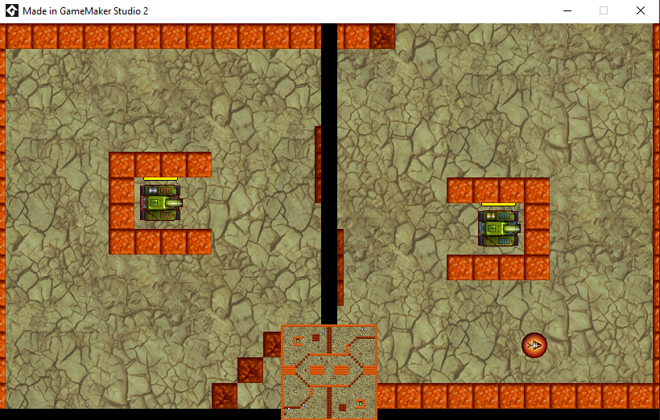
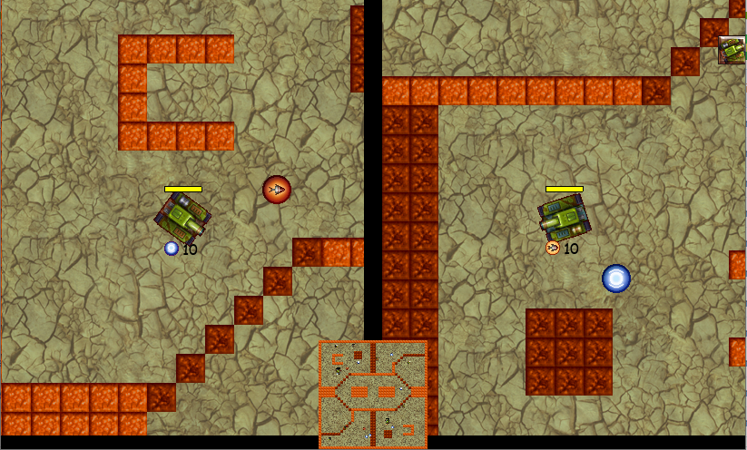

# Tank-War
Fifth GameMaker Studio 2 project for my CIT160 course (Game and Simulation Programming)

## Purpose
Learn More about objects, inheritance, viewports, and level designin GameMaker

## Summary
Two player game. Each player must destroy the other by shooting projectiles and using one of the various powerups spawned around the map.

